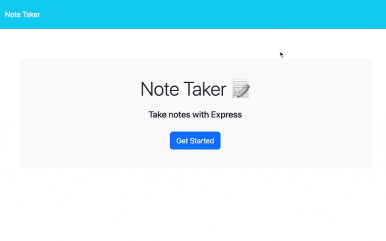
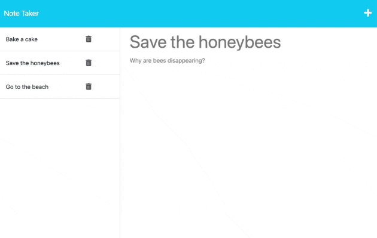
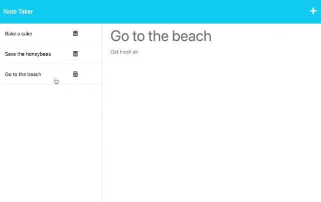

# Note Taker

## Description
Note Taker is an application where users can write and save notes. Through this application, users can organize their thoughts or keep track of tasks to be completed.

## Installation
N/A

## Usage
To start, click on the "Get Started" button. Click on "Note Title" to add the title of the note and on "Note Text" to add content to the note. When both fields are inputted, the save icon appears to the left of the plus sign. When the save icon is clicked on, the saved note is added to the left column. Click on a note to see past notes, or click on the trash can icon to delete a note. To add a new note, click on the plus icon in the top right corner.

### Add Notes

### See Past Notes

### Delete Notes

> link to deployed application: https://intense-beach-84145.herokuapp.com/

## Credit
* Special help from Scott McAnally & Bryan Swarthout with debugging code
* Jean Lescure (https://github.com/simplyhexagonal) - short-unique-id (https://www.npmjs.com/package/short-unique-id)

## License
This repository is licensed under the [MIT License](https://opensource.org/licenses/MIT).